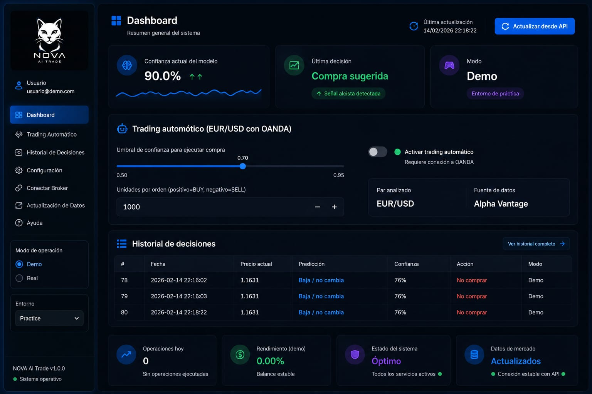
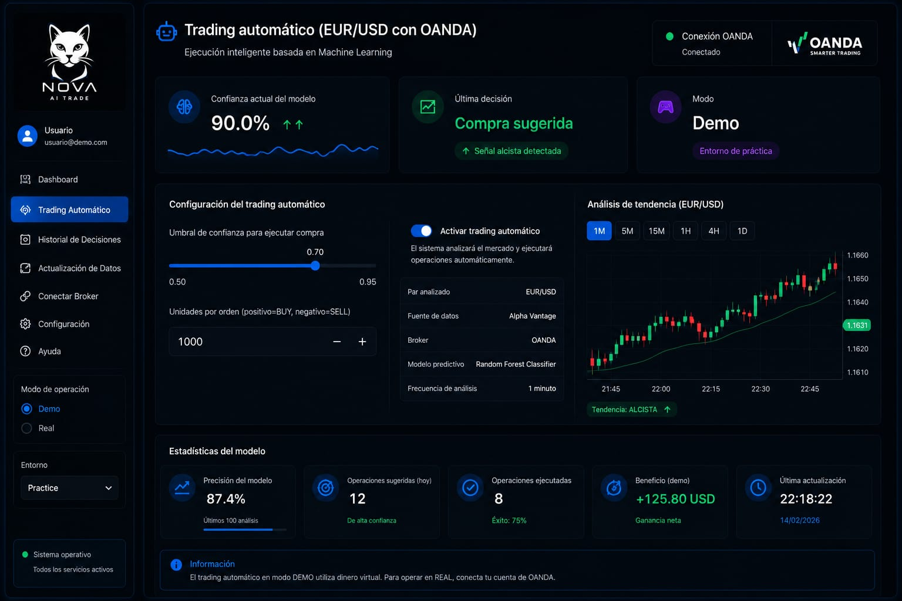
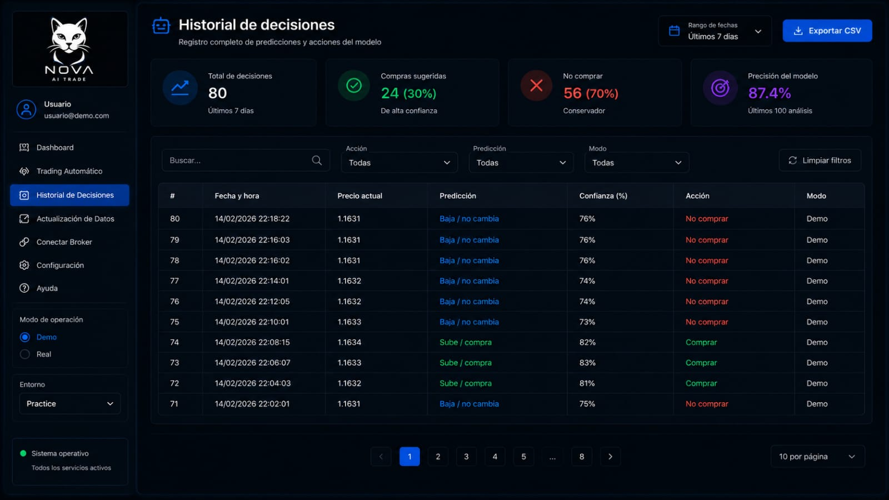
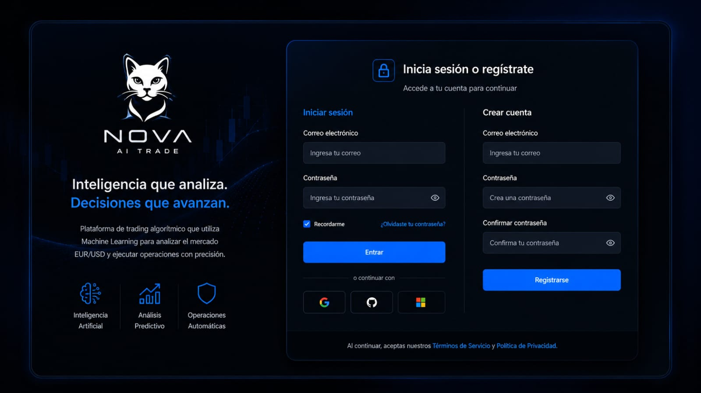

# Nova IA Trading

### Project 001 — NOVA Labs

Intelligent Forex trading platform powered by Artificial Intelligence, Machine Learning and automation.

Nova IA Trading analyzes the EUR/USD market, processes technical indicators, generates intelligent trading signals and integrates with OANDA for automated trade execution.

---

**Developed by NOVA Labs**  
*Building intelligent technology for the future.*

## Overview

Nova IA Trading is Project 001 developed by NOVA Labs.

The platform is designed to explore the integration of Artificial Intelligence, Machine Learning and automated trading technologies within the Forex market.

Its current development focuses on EUR/USD market analysis, using technical indicators and intelligent models to evaluate market conditions and generate trading signals.

The system also integrates with OANDA, allowing trading operations to be executed automatically when the configured conditions and risk parameters are met.

## Key Features

- **EUR/USD Market Analysis** — Processes Forex market data and technical indicators to evaluate current market conditions.

- **Artificial Intelligence** — Uses Machine Learning models to analyze market behavior and support trading decisions.

- **Intelligent Trading Signals** — Generates signals based on the conditions detected by the model.

- **Automated Trading** — Supports automatic trade execution when the configured conditions are met.

- **Risk Management** — Includes configurable parameters such as Stop Loss, Take Profit and trading limits.

- **OANDA Integration** — Connects with the OANDA trading environment for market access and order execution.

- **Interactive Dashboard** — Provides a centralized interface for market information, signals and platform activity.

- **Trading History** — Allows previous operations and trading activity to be reviewed.

## Technology Stack

Nova IA Trading is built using a combination of technologies focused on data analysis, artificial intelligence and trading automation.

- **Python** — Core programming language of the platform.
- **Streamlit** — Interactive web interface and application dashboard.
- **Pandas & NumPy** — Market data processing and numerical analysis.
- **Scikit-learn** — Machine Learning model development.
- **Random Forest** — Classification model used for market signal prediction.
- **Technical Analysis Indicators** — RSI and moving averages used as part of market analysis.
- **Plotly** — Interactive market data visualization.
- **OANDA API** — Trading account connectivity and automated order execution.
- **Alpha Vantage** — EUR/USD market data integration.

## Platform Screenshots

### Dashboard

Centralized interface for monitoring market information, trading signals and platform activity.

### Trading

Interface designed for monitoring and executing trading operations.

### Trading History

View of previous operations and trading activity generated within the platform.

### Secure Access

Authentication interface for controlled access to the Nova IA Trading platform.

## How It Works

Nova IA Trading follows a structured process that transforms market information into intelligent trading decisions.

### 1. Market Data
The platform collects and processes EUR/USD market data and relevant technical indicators.

### 2. AI Analysis
Machine Learning evaluates market conditions using the information processed by the system.

### 3. Trading Signal
The model generates a trading signal based on the analyzed market conditions.

### 4. Risk Management
Configured risk parameters are evaluated before a potential operation is executed.

### 5. OANDA Execution
When automated trading is enabled and the configured conditions are met, the operation can be sent to OANDA for execution.

## Project Status

Nova IA Trading is an active development project by NOVA Labs.

The platform continues to evolve as new improvements, experiments and intelligent trading technologies are developed and tested.

**Current Status:** Active Development

---

## Disclaimer

Nova IA Trading is a technology and research project developed by NOVA Labs for experimentation with Artificial Intelligence, Machine Learning, market analysis and trading automation.

The platform does not guarantee profits or specific financial results.

Trading Forex and other financial markets involves risk and may result in financial losses. Any trading decisions remain the responsibility of the user.

Nova IA Trading should not be considered financial or investment advice.

---

## About NOVA Labs

NOVA Labs is an independent technology initiative focused on the development and exploration of intelligent digital systems, Artificial Intelligence, automation and innovative software.

Nova IA Trading represents **Project 001** within the NOVA Labs ecosystem.

Future projects will continue exploring new applications of technology, artificial intelligence and digital innovation.

---

### NOVA Labs

**Building intelligent technology for the future.**

Project 001 — Nova IA Trading  
© 2026 NOVA Labs

